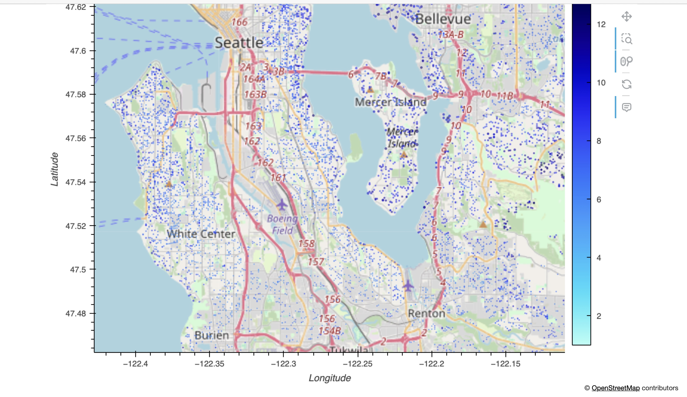
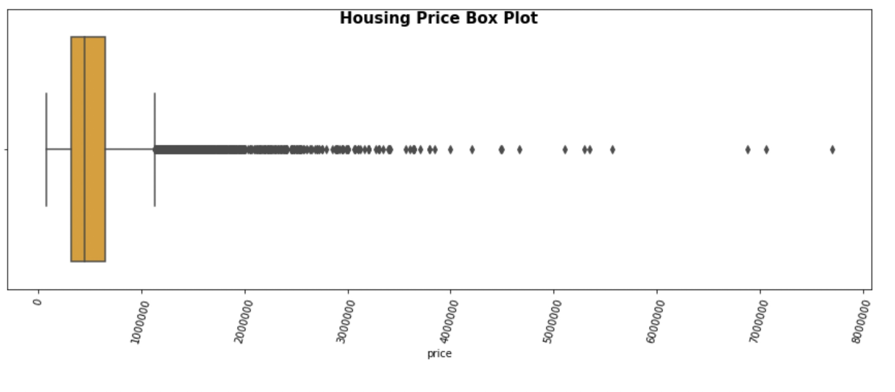
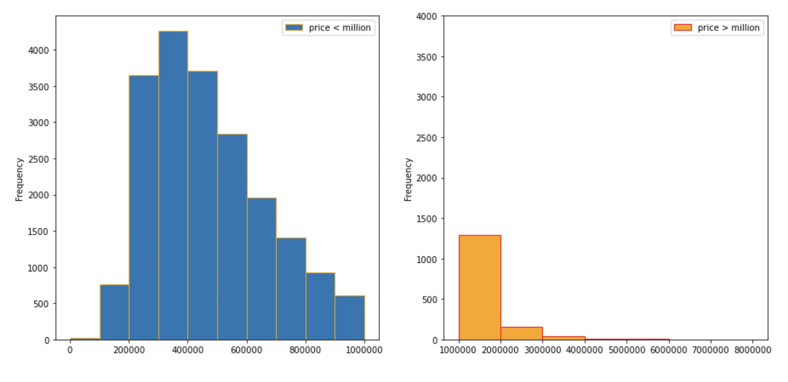
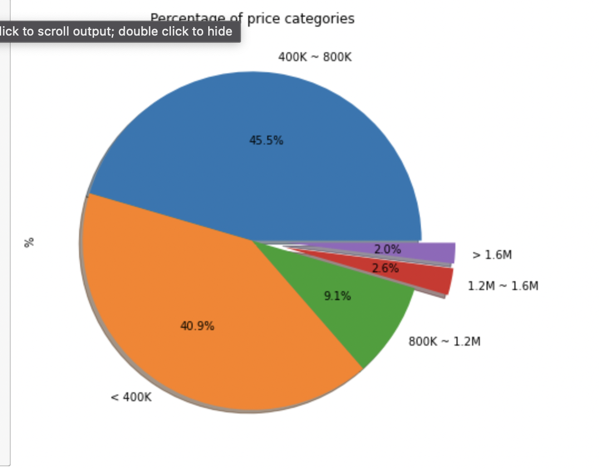
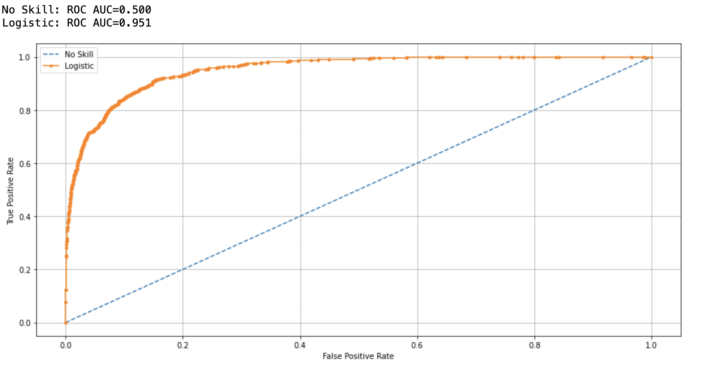
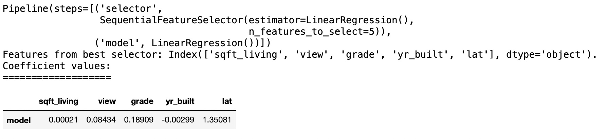
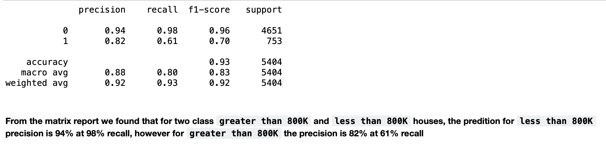
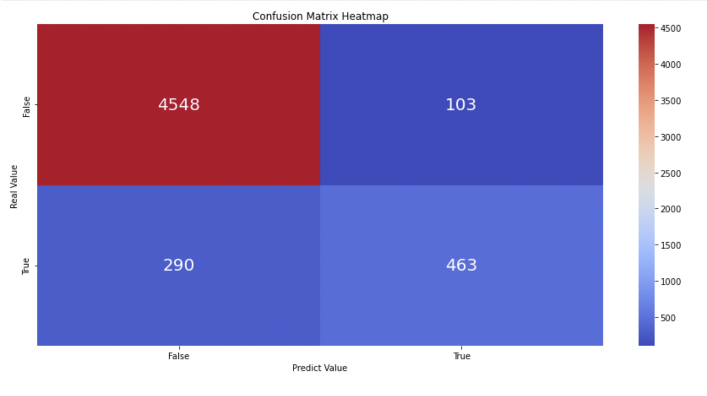

### Seattle Housing Market Analysis
**Lujunjin Liu (Vivian Liu)**

#### Executive summary

### In this application, a Seattle housing price dataset from kaggle is analyzed, modelled and predicted. The original dataset contained information on 21k houses. The goal of this report is to understand what factors make a house more or less expensive. As a result of the analysis, clear recommendations about house pricing will be provided to the real estate companies.
##### With the real-world high dimensional data, it is important to understand, prepare, and model the dataset to assist a group of real estate agents to promote their house investment and sales   
A serial important steps involves data observation, understanding, cleaning, transformation, plotting, scaling, modeling, evaluation, and recommendation.       
For the data analysis and prediction, several multiple regression models are implemented and compared, including Sequential feature selection, Ridge regularization, and Lasso regularization. Then GridSearchCV is used to optimize the hyperparameter.      
 
The real-world data demonstrates high-dimensional and polynomial features. After comparing several multiple regression models, the powerful machine learning choosed the sequential feature selection as the best model, and recommended 5 best features: sqft_living, view, grade, yr_built, lat
The final results demonstrated that: among all the factors, the most important feature is the living area to affect the house price, the larger the higher, secondly the better view, the higher the price. Moreover, the grade and building year keep the house values.

#### Rational
Why should anyone care about this question?

#### The real estate market is very competitive and contains a huge amount of information. 
For any housing investment, it is essential for every real estate investor to understand the market, how to value the similar properties and when to invest a house.

#### Research Question
What are you trying to answer?

There are important factors to analyze the housing market.   
To ensure the safe and profitable investments, it is necessary:
* To investigate the most significant facters controlling the housing price.  
* To understand the graphic aspects of housing locations.   
* To build best models through comparing different machine learning techniques.  

#### Data Sources
What data will you use to answer you question?

The current Seattle housing price dataset is from kaggle. The original dataset contained information on 21k houses.    
The housing information includes date, price, bedrooms, bathrooms, sqft_living,sqft_lot, floors, waterfront, view, condition, grade, sqft_above, sqft_basement, yr_built, yr_renovated, zipcode, lat, long, sqft_living15, and sqft_lot15.   

#### Data Understanding

* There are total 21 columns, including 5 float64, 15 int64 and 1 object data types:    
 * price, bathrooms, floors, lat and long: float64
 * data: object   
    
* Statistic description indicates:   
 * The minimal price is 75,000, max is 7,700,000, and mean is around 540,000.
 * Housing price box plot indicates that there are many data outliers when the price is more than 1,000,000.
 * To check the price statistic distribution, price histogram plots are seperated based on price less than 1 million and more than 1 million.
 * Square area box plot lists 6 different types of square area distribution. 
    
* There is no null value in the table.
* Packages: Pandas, Numpy, Matplotlib, Seaborn, hvplot

#### Data Cleaning   
* Remove outliers in the selective columns: price > 2,500,000
* Plot the correlation map 
* Keep important features and drop columns with object type

#### Methodology
What methods are you using to answer the question?

#### Machine Learning Models
#### Multiple Regression Models
The current housing price dataset is high-dimensional and contains polynomial features.
Before applying multiple regression models, it is important to transform and scale the data for the best results.   
For processing training and testing sets, as the squared error will increase the price difference, it is necessary to use numpy.log function to rescale price (y sets)   
Sequential feature selection (greedy algorithm), Ridge regularization, and Lasso regularizationand are utilized to find the best model and the best features. GridSearchCV is used to process the hyperparameter.      

#### Logistic Regression
To enhance the model from previous session, I also tried to use a classificatin model to check whether it works differently than the regression model.   
Logistic Regression model is a classification model that works on Categorical data especially proficent on two class dataset.   
In order to make it works smoothly, I tried to categorize the price which is the target value into 5 different bins and 2 bins, the 2 bins version works great.    
The purpose of the model is to determin a given housing data belongs to the `greater than 800K` price range or `less than 800K` price range.   
Logestic Regression has a high accuracy and precision.   

#### Baseline of the model

To check the model works profeciently, I also need to setup a baseline to test the model.   
Normally the baseline is 50% because it's a random guess, it makes no sense that if our model couldn't beat the baseline.
By testing the model performance, I finally find that the ROC value of the model reaches 0.951

#### Results
What did your research find?

##### In this report, the real-world Seatle house price dataset is analyzed using multiple regression models to provide valuable information for the real estate companies and agents. 
To investigate the best factors to affect the house price, important steps are implemented: 
* Data observation indicates that there are mixed data types of columns and unrealistic outlier numbers for price.  
* Therefore, in order to understand the real estate market, the dataset is cleaned and transformed with the 
data cleaning and preparation methods.   
* Since the house price less than 250,000 takes about 95% of the business data, it is important to focus the analysis into this field.      
* Different types of plotting provide general and statistic pictures for the main market, which can also help to increase the total data quality. 
   
The real-world data demonstrates high-dimensional and polynomial features. After comparing several multiple regression models, the powerful machine learning choosed the sequential feature selection as the best model, and recommended 5 best features: sqft_living, view, grade, yr_built, lat
The final results demonstrated that: among all the factors, the most important feature is the living area to affect the house price, the larger the higher, secondly the better view, the higher the price. Moreover, the grade and building year keep the house values.
From the matrix report we found that for two class greater than 800K and less than 800K houses, the prediction for less than 800K precision is 94% and 98% recall, however for greater than 800K the precision is 82% at 61% recall.

#### Next steps
What suggestions do you have for next steps?

According to the machine learning prediction model generated in this  report, it is useful to compare our predictive results with the estimated market value from the online market information.
It will provide more realistic factors and ideas for the further market research.

#### Outline of project

- [Link to notebook 1]()

- [Link to notebook 2]()

##### Contact and Further Information

Vivian Liu   
email: liulujunjin@gmail.com